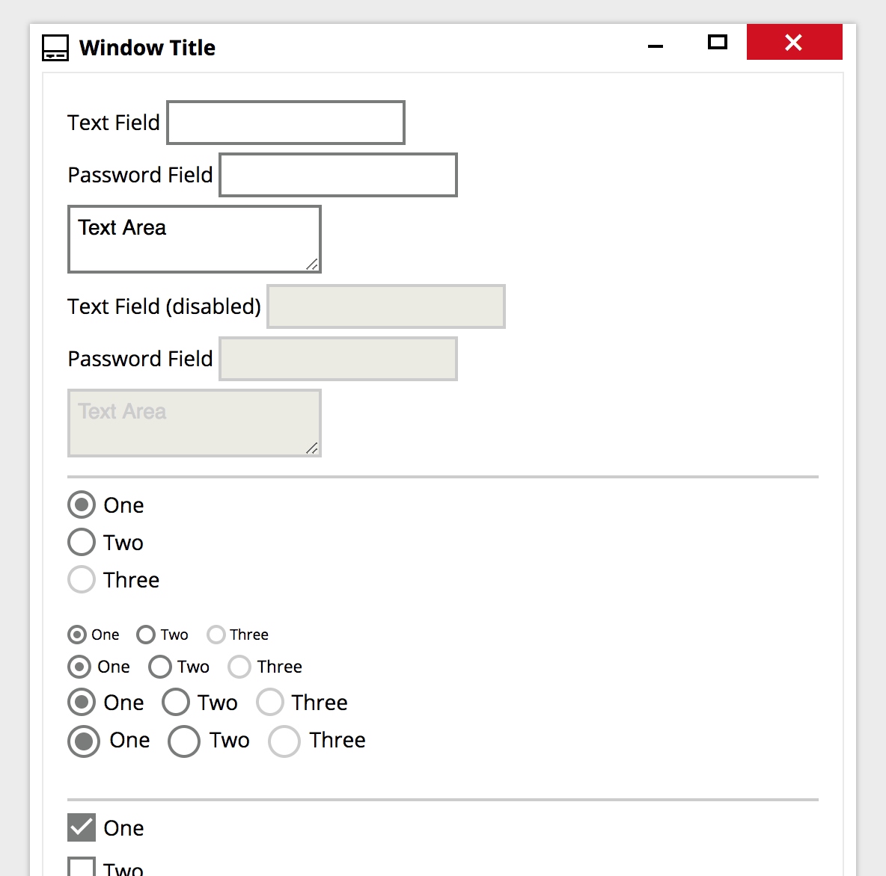

# Meta UI
Cross platform UI for Hybird (HTML UI) apps.

## Purpose
HTML5/CSS framework that provides Native-like themes for Desktop applications (Electron based apps). MetaUI is not limited to desktop. It's design to work in all major browsers for website development. Also we plan on having mobile OS theme support in the future.

**NOTE: NOT READY FOR PRODUCTION USE**

Screenshots for the Cocoa (macOS) and Metro (Windows):

## Why Another Framework/Library?
Because there are almost no great UI frameworks that will make Hybird apps look Native to the OS its running on. Second, would it be great if we had one set of "standard" UI components that work exactly the same but can easily look different based on OS or custom theming. Think Bootstrap but better. Designed from the ground up to look and feel native and web standards compilant.

## TODOs (Production version 1.0)
* Complete Cocoa theme
* Complete Metro theme
* Create documentation

## Roadmap (after versoin 1.0)
* MetaUI Web Components (StencilJS or Polymer)
* Boilerplate Electron project w/ MetaUI
  * Simple
  * React-based
  * Angular-based
  * Vue-based
* MetaUI React components
* MetaUI Angular components
* MetaUI Vue components
* Mobile UI support
  * iOS theme
  * Android Material theme
  * Cordova/PhoneGAP boilerplate
    * Simple
    * React-based
    * Angular-based
    * Vue-based

